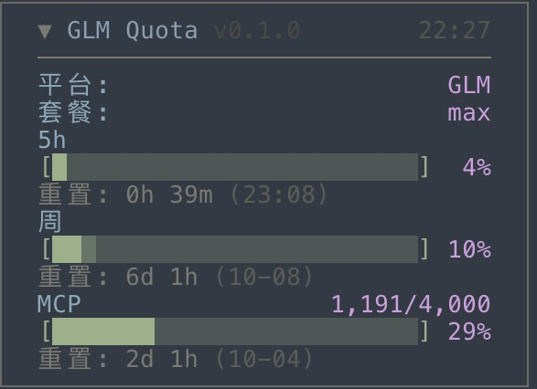
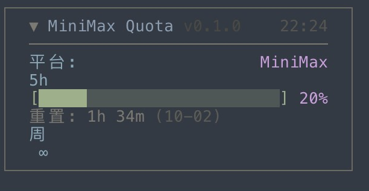

# opencode-quota-switch

OpenCode v2 TUI 插件：**侧边栏自动跟随当前会话正在用的 provider** 显示套餐用量。

切到 MiniMax 就显示 MiniMax，切到 GLM 就显示 GLM —— 不用手动切开关。



*GLM：三窗口（5h · 周 · MCP）+ 套餐等级。窗口名 / 进度条 / 重置倒计时三层，标题行可点击折叠，右上角是本次抓取时间。*



*MiniMax：同一个面板自动换成 MiniMax 的数据。周窗口显示 `∞` 是因为该档位不设限 —— 各家有多少窗口、显示什么，全由接口返回决定，插件不编造。*

## 支持的平台

探测到当前会话用的 provider 后，按下表拉取用量。

| Provider | 展示内容 | 额度端点 | 状态 |
|---|---|---|---|
| **GLM / 智谱**<br>`zhipuai-coding-plan` | 5h · 周 · MCP 三窗口 + 套餐等级 | `open.bigmodel.cn/api/monitor/usage/quota/limit` | ✅ 实测跑通 |
| **MiniMax**<br>`minimax-cn-coding-plan` | 5h + 周（该窗口不设限时显示 `∞`） | `api.minimaxi.com/v1/token_plan/remains` | ✅ 实测跑通 |
| **Kimi for Coding**<br>`kimi-for-coding` | 周窗口（+ 接口返回的其它窗口 · 月消金额） | `api.kimi.com/coding/v1/usages` | ✅ 实测跑通 |
| **DeepSeek**<br>`deepseek` | 仅账户余额 | `api.deepseek.com/user/balance` | ✅ 实测跑通 |
| **OpenCode Go**<br>`opencode-go` | 5h · 周 · 月三窗口 | `opencode.ai/zen/go/v1/usage` | ⚠️ 已实现，成功路径待验证 |

**OpenCode Go 需要你登录过才会激活**：`opencode auth login opencode-go`。本仓库的开发机上没有该订阅，代码只验证到了 401 鉴权失败分支，200 成功响应的字段名取自社区实现 —— 首次拿到 key 后请对照真实 body 校对 `src/parsers/opencode-go.ts` 的 `WINDOW_LABELS`，并观察面板自动刷新确认。

> **DeepSeek 只显示余额是完整实现，不是残缺。** DeepSeek 没有 Coding Plan，只按量计费，`/user/coding_plan`、`/coding/v1/usages`、`/user/usage`、`/api/monitor/usage/quota/limit` 全部 404 —— 没有任何配额窗口接口可查。

### 试过但做不了的

这几家不是没写，是**纯 API key 调不通**：

| Provider | 卡在哪 |
|---|---|
| 火山方舟 / 豆包 | 控制面只认 volc-sso 登录态或 AK/SK V4 签名。`auth.json` 里的 key 是**数据面** key，对配额无效（`arkcli usage plan --api-key` 明确报 `--api-key only applies to data-plane commands`） |
| 阿里百炼 | 官方 FAQ 原文「暂无法查看」「不支持」，实测 10 个候选路径全 404 |
| 腾讯混元 | `api.lkeap.cloud.tencent.com` 先鉴权后路由，假 key 探测路径完全无效 |
| 阶跃星辰 | `/v1/accounts` 可用，但 Step Plan 是独立 Credit 体系，12 个候选路径全 404 |
| 小米 MiMo | cookie 门禁（`api-platform_serviceToken`），拿不到纯 key 接口 |
| 百度文心 | OpenCode 根本不支持百度 provider |
| 硅基流动 | `/v1/user/info` 已废弃，返回 `HTTP 410 {"code":20092}`；无公开余额接口 |

要做火山方舟/百炼只能 shell out 官方 CLI（需要额外登录态），或做本地估算（数消息条数 × 官方额度表）—— 两者都不是真实用量，故未实现。

## 安装

```bash
git clone https://github.com/nigo81/opencode-quota-switch.git
cd opencode-quota-switch
npm install && npm run build
./install.sh
```

`install.sh` 把仓库软链进 OpenCode 的 TUI 插件缓存（`~/.cache/opencode/npm/`），并在 `~/.config/opencode/cli.json` 的 `plugins` 数组注册裸包名。**改完代码重跑 `npm run build && ./install.sh`，重启 OpenCode 客户端即生效**，不用重新发布。

> **为什么不用 `opencode plugin add <git-url>`**：opencode 2.0.21 会失败并报 `NpmInstallFailedError: git dep preparation failed`。同一个 git 依赖用 npm 与 bun 单独安装都成功，所以是宿主安装器自身的 bug。本地路径 spec（`./x`、`file:./x`）在 V2 也不支持。缓存注入走的是宿主加载 npm 插件时本来就会读的目录，实测可用。

**API key 从哪来**：宿主没有暴露 provider 列表和凭证，插件直接读 `~/.local/share/opencode/auth.json`（只读、30s TTL 缓存），只放进内存去打厂商自己的 HTTPS 接口 —— 不落盘、不打日志、不进错误文案。

### 卸载

```bash
opencode plugin remove opencode-quota-switch
rm -rf ~/.cache/opencode/npm/opencode-quota-switch@latest
```

## 工作原理

```
api.client.session.list()      宿主 API
      ↓  按 time.viewed 倒序
当前会话的 model.providerID     → 白名单校验（必须在有凭证的 providerID 内）
      ↓
src/providers/index.ts         providerID → adapter
      ↓
src/parsers/*.ts               纯函数解析，无网络、无依赖
      ↓
src/ui/panel.tsx               Solid 面板渲染进 api.ui.slot({prepend:"sidebar.content"})
```

**判定当前 provider 的过程**：宿主没有「当前模型」这个 API（`api.ui.model.current` 是 `undefined`），所以只能从会话反推 —— 列出所有会话，按最后查看时间 `time.viewed` 取最新的一个，读它的 `model.providerID`。

几个踩过的坑（都在 `src/active-provider.ts` 注释里）：

- `session.active()` **不是「当前会话」，是「正在生成中的会话」**，回复一结束就返回空
- 会话的时间字段在 API 层叫 `time`（对象），**不叫** `time_viewed` / `time_updated`（那是 DB 列名）
- 白名单是必须的：`api.data.session.status()` 会返回字符串 `"idle"`，不校验就会把 `"idle"` 当成 providerID
- 探测失败时**沿用上次结果**，不回落成列表第一个（否则每 3 秒闪一次 GLM）

子会话不污染判定：`time.viewed` 榜上排前面的始终是主会话。

### 刷新时机

| 时机 | 行为 |
|---|---|
| 每 **60 秒** | 重新拉一次用量（面板右上角的时钟就是 `fetchedAt`） |
| 每 **3 秒** | 只探测 provider，**不**发网络请求；探测到变了才立刻拉一次 |
| `/quota-refresh` | 立即重新拉取。⚠️ opencode 2.0.22 上**注册不上**（宿主 bug，见下文「厂商接口的坑」），60s 自动刷新是唯一刷新路径 |
| 点标题行 | 折叠 / 展开。⚠️ 折叠/边框状态在 2.0.22 上**仅本次会话内有效**（宿主 `api.storage` 每次调用都抛异常，见下文），重启后回到默认展开 |

切到白名单外的模型（比如 Claude）时，面板**保持上次的值不动** —— 刻意如此，比显示一个乱跳的数字好。

## 配置

`cli.json` 的 `plugins` 数组项可带 `options`：

```jsonc
{
  "plugins": [
    "opencode-quota-switch",
    { "package": "opencode-quota-switch",
      "options": { "intervalMs": 60000, "providers": ["GLM", "MiniMax"] } }
  ]
}
```

| option | 默认 | 说明 |
|---|---|---|
| `intervalMs` | `60000` | 拉取间隔，下限 15000 |
| `providers` | 全部 | 白名单，值为 adapter id（`glm`/`minimax`/`kimi`/`deepseek`/`opencode-go`）或展示名 |
| `title` | 按 provider 自动 | 面板标题前缀 |

## 扩展新 provider

三步，provider 之间零耦合：

1. `src/parsers/<name>.ts` — 写一个 `(json: unknown) => ProviderQuota` 纯函数
2. `src/providers/<name>.ts` — 导出 adapter：`{ id, label, match, fetch }`
3. `src/providers/index.ts` — 把 adapter 加进 `PROVIDERS` 数组

`QuotaWindow.usedPct` 的语义是**已用百分比**（不是剩余），`sortByDisplayOrder` 会按 `windowRank` 排序（5h → 周 → 其余）。

`match` 决定认领哪些宿主 provider 条目，**要精确**。反面教材：想匹配 `opencode-go` 时如果写成裸 `"opencode"`，会把 `opencode-zen` 等同族 provider 也吞掉导致面板串台。

`src/parsers/common.ts` 里的 `asRecord` / `toNum` / `strField` / `pctOf` / `formatReset` 是共享工具，别重复造。

## 厂商接口的坑

**这些不是能靠读文档绕过的，每一条都是实测踩出来的。**

### 通用

- **`dependencies` 必须保持为空。** `@opentui/solid` / `@opentui/core` / `solid-js` 全部走宿主提供（只放 `devDependencies`）。插件自带一份渲染库会出现**两个 Solid 实例**，信号订阅桥接不到宿主渲染循环，面板**永久冻结在首帧**。上游 `opencode-quota-usage` 正是因为把 `@opentui/core` 钉在 `dependencies` 里，才被迫从 Solid 降级成命令式渲染。
- **模块必须同时导出 `{ id, tui, setup }`。** 只导出 `tui` 的话，模块顶层会执行但入口永不被调用（V2 宿主读的是 `setup`）。
- **必须用 `createComponent(QuotaPanel, {...})` 在宿主的响应式 owner 内实例化**，直接调 `QuotaPanel({...})` 不建 owner、不渲染。
- **打包必须用 `generate: "universal"` + `moduleName: "@opentui/solid"`**（默认的 `solid-js/web` 是 DOM 那套，渲染到 opentui 上不显示），且产物必须是预打包的 `dist/tui.js` —— 宿主加载 npm 缓存中的 TUI 插件走「已打包产物」路径，发裸 TS 会报 `Cannot find package 'solid-js' imported from .../src/ui/panel.tsx`。
- **宿主不打印 setup 内的异常栈**，且 `api.lifecycle` 是 `undefined`（`@opencode-ai/plugin` 的类型声明与 v2.0.21 运行时不同步，别信它）。排查只能自己建 trace，**默认静默**，要开必须自己 export 环境变量：

  ```bash
  OPENCODE_QUOTA_SWITCH_TRACE=1 opencode
  cat ~/.local/state/opencode/quota-switch.log
  ```

  日志落在 `~/.local/state/opencode/quota-switch.log`（0600，超 512KB 自动清空），home 绝对路径会被压成 `~`。**改这个插件前别猜字段名**——先把 trace 打开看宿主的真实 API 成员，踩过的坑都记在 `src/active-provider.ts` 注释里。
- **`api.keymap.layer` 在 2.0.22 上永远抛 `Keymap.Provider is missing`。** setup 阶段抛，8 秒后直调也抛，塞进全新 `createRoot` 里还是抛——Solid 的 context 按 owner 链向上找，插件闭包里没有 Keymap 祖先，重试/重建 owner 都无解（重试机制试过并已撤）。结果就是 `/quota-refresh` 在该版本注册不上，只剩 60s 自动刷新。
- **`api.storage` 在 2.0.22 上是坏的，每次调用都抛。** `store`/`memory` 实际是 `(key, value?)` 函数（宿主自动加 `plugin.<pluginId>.` 前缀），读恒抛 `undefined is not an object (evaluating 'b.initial')`，写连 `{a:1}`、`false` 都报 `Storage values must be JSON-compatible objects`；setup/+4s/+12s 表现一致，不是初始化竞态。面板的折叠/边框状态在该版本上因此仅会话内有效（适配层 `src/kv-adapter.ts` 保留探测分支：宿主修好后持久化自动生效，无需改代码）。
- **修复记录**：侧栏折叠再展开后面板曾**永久消失**——之前缓存了 Solid 组件实例，宿主卸载侧栏时会 dispose 挂载树，缓存实例成死树，重挂时递回去的就是尸体。现在每次 render 都新建实例（`onCleanup` 保证不泄漏定时器）。

### GLM

- **监控接口用裸 key**（`Authorization: <key>`，不带 `Bearer`）。国际站 `api.z.ai` 反而要 `Bearer`。混用会静默认证失败。
- **业务失败返回 HTTP 200**（`{success: false, code, msg}`），必须校验信封，否则空的 `data.limits` 会伪装成「没有窗口」。
- **5h / 周窗口靠字段判定，不能按重置时间排序。** 新套餐实测 `unit=3/number=5` 是 5h、`unit=6/number=1` 是周；但 5h 窗口重置的瞬间 `nextResetTime` 可能缺失，按时间排序会错位标签（实证事故）。
- `TOKENS_LIMIT`（老套餐）和 `CREDIT_LIMIT`（新套餐）形状不同，两者都要认；`TIME_LIMIT` 是 MCP 窗口。

### MiniMax

- **`*_usage_count` 是「剩余」不是「已用」。** 字段语义与老版 `coding_plan/remains` 相反，直接读会得到反向数字。只用 `current_*_remaining_percent`，`usedPct = 100 - remaining`。
- **`*_status === 3` 表示「该窗口对你的档位不设限」**，必须整个窗口显示 `∞`，不是显示 0%。
- 老端点 `/v1/api/openplatform/coding_plan/remains` 已加 cookie 门禁（`status_code 1004`），不可用。

### Kimi

- **必须带 `/v1`**：`api.kimi.com/coding/usages` 是 404，`/coding/v1/usages` 才是 200。

### DeepSeek

- 无 Coding Plan（见上文「支持的平台」），只走 `/user/balance`。余额通过 `extras` 展示，不是配额窗口。

### OpenCode Go

- **`percent` 是「已用」0-100**，和 MiniMax 的 `*_remaining_percent`（剩余）语义**相反**。照抄 MiniMax 的 `100 - percent` 会把进度条画反。
- **`status === "rate-limited"` 表示 0% 剩余 = 已用 100%**，且此时 `percent` 可能仍是旧值甚至缺失。必须让 `status` 优先于 `percent`，否则限流后反而显示剩余额度。
- **`/zen/go/v1/models` 不校验鉴权，无效 key 也返回 200** —— 不能拿它当连通性测试或兜底。

### 通用坑：控制台型接口的错误信封是 HTTP 200

Z.AI 这类接口业务失败返回 **HTTP 200 + body 里带错误码**（`{"code":401,"success":false}`）。只看 HTTP status 会把失败当成功。`getJsonRaw()` 就是为此加的：非 2xx 也把 body 交回 adapter 自己判，同时 403 必须读 body 才能区分「没订阅」和「鉴权失败」。

## 开发

```bash
npm install
npm run build       # tsc --noEmit + esbuild 打包成 dist/tui.js
npm run typecheck
npx tsx scripts/smoke-quota.ts   # 绕开 UI 直连各家真实接口，验 parser 契约
```

**改完 adapter 先跑 smoke。** 它读 `~/.local/share/opencode/auth.json` 里真实存在的凭证去打真实接口，打印每家的窗口和百分比 —— 比开 OpenCode 看面板快得多。没有凭证的 provider 会自动跳过。

`reference/` 存放上游 `opencode-quota-usage@0.3.7` 的原始文件，仅供对照开发，不参与编译也不发布。

## 参考项目

本项目在以下开源工作的基础上构建，感谢原作者：

- **[opencode-quota-usage](https://www.npmjs.com/package/opencode-quota-usage)**（MIT）— **本项目的代码基座**。GLM / Kimi / DeepSeek 的解析器与 provider 匹配逻辑派生自它的 `parsers.ts` 与 `main.ts`，其字段语义踩坑注释被完整保留在对应代码上。
- **[opencode-glm-vistatus](https://github.com/WuJunkai2004/opencode-glm-vistatus)**（MIT）— 侧边栏面板的**视觉与交互参考**。折叠行为、低饱和调色、半格进度条字形、CJK 宽度对齐工具、重置倒计时格式均参照其实现。
- **[steipete/CodexBar](https://github.com/steipete/CodexBar)** — 各 provider 额度端点、鉴权头与字段语义的主要考证来源，其 `docs/<provider>.md` 是端点事实的可靠出处。
- **[openchamber/openchamber](https://github.com/openchamber/openchamber/blob/main/packages/web/server/lib/quota/DOCUMENTATION.md)** — 额度接口**字段语义陷阱**的权威整理（MiniMax 端点上 `*_usage_count` 返回「剩余」而非「已用」这一点即出自此处）。
- **[farion1231/cc-switch](https://github.com/farion1231/cc-switch/blob/main/src-tauri/src/services/coding_plan.rs)** — 多 provider 套餐额度实现的参照（Kimi / GLM / MiniMax / 火山方舟 / OpenCode Go）。
- **[MiniMax 官方文档](https://platform.minimaxi.com/docs/token-plan/faq)** — `/v1/token_plan/remains` 端点的官方出处。

## License

MIT

`src/parsers/{glm,kimi,deepseek}.ts` 与 `src/http.ts` 派生自 `opencode-quota-usage`（MIT，Copyright its contributors）。`src/ui/` 的渲染手法参照 `opencode-glm-vistatus`（MIT，Copyright WuJunkai2004）。
